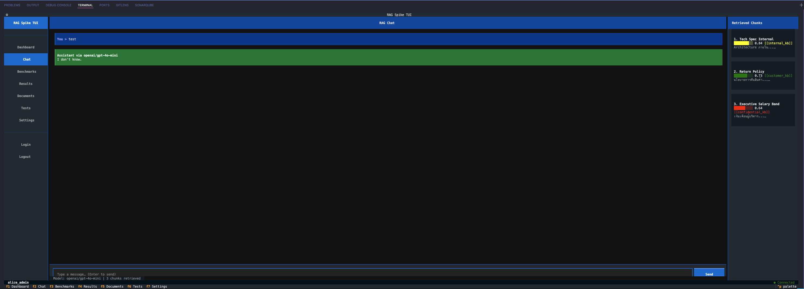
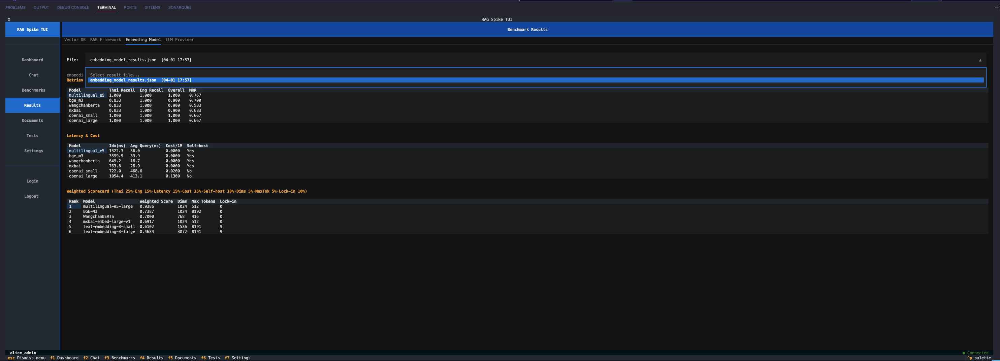

# spike-rak

> **RAG Tech Stack Spike** — วิจัยเชิงทดลองเพื่อเลือก Tech Stack สำหรับระบบ RAG (Retrieval-Augmented Generation) ก่อนนำไปใช้ใน Production

---



---

## 

## ภาพรวม

โปรเจคนี้ทดสอบและเปรียบเทียบ **15+ components** ใน 6 หมวดหมู่ เพื่อให้ทีมตัดสินใจเลือก tech stack ร่วมกันผ่าน RFC

```
คำถามผู้ใช้ (Web / LINE / Discord)
         │
         ▼
   ┌─────────────────────────────────┐
   │   FastAPI + JWT + RBAC          │ ← Phase 4: API & Auth
   │   (Permission-filtered access)  │
   └──────────┬──────────────────────┘
              │
   ┌──────────▼──────────────────────┐
   │   RAG Pipeline                  │ ← Phase 2: Framework
   │   ┌──────────┐  ┌────────────┐  │
   │   │ Embedding │  │ LLM Call   │  │ ← Phase 3 + 3.5
   │   │ Model     │  │ (OpenAI-   │  │
   │   └─────┬────┘  │ compatible)│  │
   │         │       └────────────┘  │
   │   ┌─────▼────────────────────┐  │
   │   │ Vector DB                │  │ ← Phase 1
   │   │ (metadata filter by ACL) │  │
   │   └──────────────────────────┘  │
   └─────────────────────────────────┘
```

### สิ่งที่ทดสอบ

| Phase | หมวด             | ตัวเลือกที่ทดสอบ                                     |
| ----- | ---------------- | ---------------------------------------------------- |
| 1     | Vector Database  | Qdrant, pgvector, Milvus, OpenSearch                 |
| 2     | RAG Framework    | LlamaIndex, LangChain, Haystack, Bare Metal          |
| 3     | Embedding Model  | BGE-M3, multilingual-E5, MxBai, OpenAI (large/small) |
| 3.5   | LLM Provider     | OpenRouter, OpenAI Direct, Anthropic Direct, Ollama  |
| 4     | API & Auth       | FastAPI + JWT + RBAC + Permission-filtered Retrieval |
| 5     | Integration Test | 7 E2E scenarios + Locust load test                   |
| 6     | RFC & Docs       | RFC document, ADRs, presentation                     |

---

## Quick Start

```bash
# ข้อกำหนด: Python >= 3.11, uv >= 0.5
# Phase 1 ต้องการ Docker เพิ่มเติม

# 1. Setup
cp .env.example .env        # กรอก API keys (หลายอันเป็น optional)
make setup                   # ตรวจสอบ prerequisites

# 2. เลือก phase ที่ต้องการ ──────────────────────────────────────

# ทดสอบ API Server (ไม่ต้องการ API key — ใช้ mock LLM)
make install-api && make api-run
# → http://localhost:8000/docs

# รัน Integration Tests
make install-test && make test-integration

# เปรียบเทียบ Vector DB (ต้องการ Docker)
make up-db && make install && make benchmark-quick

# เปรียบเทียบ Embedding Models (ไม่ต้องการ API key)
make install-embed && make embed-eval
```

> ดูรายละเอียดทุก phase: [`docs/guides/quickstart.md`](docs/guides/quickstart.md)

---

## โครงสร้างโปรเจค

```
spike-rak/
├── api/                          ← Phase 4: FastAPI server (RAG API + Auth)
│   ├── auth/                     │   JWT, RBAC, permissions
│   ├── rag/                      │   retrieval + pipeline + models
│   ├── routes/                   │   auth, chat, documents, webhooks/line
│   ├── store.py                  │   in-memory PoC stores
│   └── main.py                  │   FastAPI app entry point
├── benchmarks/
│   ├── vector-db/                ← Phase 1: VectorDBClient ABC + 4 adapters
│   ├── rag-framework/            ← Phase 2: BaseRAGPipeline ABC + 4 implementations
│   ├── embedding-model/          ← Phase 3: BaseEmbeddingModel ABC + 5 adapters
│   └── llm-provider/             ← Phase 3.5: BaseLLMProvider ABC + 4 adapters
├── tests/
│   ├── integration/              ← Phase 5: 7 E2E test scenarios (pytest)
│   └── load/                     ← Phase 5: Locust load tests
├── datasets/                     ← Test data: Thai HR policy, English tech docs, FAQ
├── docker/                       ← docker-compose for Vector DBs
├── docs/                         ← เอกสารทั้งหมด
│   ├── phases/                   │   เอกสารแต่ละ phase
│   ├── guides/                   │   คู่มือการใช้งาน
│   ├── adr/                      │   Architecture Decision Records (6 ADRs)
│   ├── rfc/                      │   RFC-001: Tech Stack Selection
│   └── presentation/             │   Presentation outline
├── Makefile                      ← คำสั่งลัดทุก phase
├── pyproject.toml                ← Dependencies (จัดเป็น groups ต่อ phase)
├── SETUP.md                      ← Setup guide ละเอียด
└── CONTRIBUTING.md               ← วิธี contribute / เพิ่ม adapter
```

---

## คำสั่งหลัก

```bash
make help                    # แสดงคำสั่งทั้งหมด

# ── Setup & Dependencies ──────────────────────────────────
make setup                   # ตรวจ prerequisites + สร้าง .env
make install                 # Phase 1 deps (bench-vectordb)
make install-rag             # Phase 2 deps (~2GB: torch + frameworks)
make install-embed           # Phase 3 deps (~1.5GB: torch + models)
make install-llm             # Phase 3.5 deps
make install-api             # Phase 4 deps
make install-test            # Phase 5 deps (includes api)

# ── Phase 1: Vector DB ────────────────────────────────────
make up-db                   # Start ทุก Vector DB (Docker)
make up-db DB=qdrant         # Start DB เดียว
make benchmark-quick         # Benchmark 10K vectors
make down-db                 # Stop + remove volumes

# ── Phase 2: RAG Framework ────────────────────────────────
make rag-eval                # ทดสอบทุก framework (ต้องการ OPENROUTER_API_KEY)
make rag-eval-no-llm         # Indexing เท่านั้น (ไม่ต้องการ API key)

# ── Phase 3: Embedding Model ──────────────────────────────
make embed-eval              # Open-source models (ไม่ต้องการ API key)
make embed-eval-all          # ทุก models รวม OpenAI

# ── Phase 3.5: LLM Provider ──────────────────────────────
make llm-eval                # Default provider
make llm-eval-all            # ทุก providers

# ── Phase 4: API Server ──────────────────────────────────
make api-run                 # Start server → http://localhost:8000/docs
make api-demo                # Smoke test

# ── Phase 5: Integration Tests ────────────────────────────
make test-integration        # รัน 27 tests (7 scenarios)
make load-test               # Locust load test (ต้อง api-run ก่อน)
```

---

## Test Users (Phase 4-5)

| Username         | Password   | Role     | เห็นเอกสาร                                    |
| ---------------- | ---------- | -------- | --------------------------------------------- |
| `alice_admin`    | `admin123` | admin    | ทุกระดับ (customer + internal + confidential) |
| `bob_employee`   | `emp123`   | employee | customer + internal                           |
| `carol_customer` | `cust123`  | customer | customer เท่านั้น                             |
| `svc_line_bot`   | `svc123`   | service  | customer + internal                           |

---

## Environment Variables

Copy `.env.example` → `.env` แล้วกรอกค่าที่ต้องการ

| Variable              | จำเป็นสำหรับ            | หมายเหตุ                       |
| --------------------- | ----------------------- | ------------------------------ |
| `OPENROUTER_API_KEY`  | Phase 2, 3.5, 4         | ไม่กรอก = mock LLM             |
| `OPENAI_API_KEY`      | Phase 3 (OpenAI models) | ไม่จำเป็นถ้าใช้แค่ open-source |
| `ANTHROPIC_API_KEY`   | Phase 3.5               | optional                       |
| `JWT_SECRET_KEY`      | Phase 4-5               | มี default สำหรับ dev          |
| `LINE_CHANNEL_SECRET` | Phase 4 LINE webhook    | optional                       |

---

## หลักการออกแบบ: Anti-Vendor-Lock-in

ทุก component อยู่หลัง **Abstract Base Class** — swap ได้โดยแก้ config ไม่ต้อง rewrite business logic

```
Application ─→ ABC Interface ─→ Adapter A (Qdrant)
                              ─→ Adapter B (pgvector)     ← swap ได้
                              ─→ Adapter C (Milvus)
```

- ทดสอบกับ >= 2 providers เสมอ เพื่อพิสูจน์ว่า swap ได้จริง
- ใช้ OpenAI-compatible API เป็น standard protocol
- Data format export/import ได้

ดูรายละเอียด: [`docs/adr/ADR-006-anti-lock-in.md`](docs/adr/ADR-006-anti-lock-in.md)

---

## เอกสาร

| เอกสาร                                                                     | เนื้อหา                                   |
| -------------------------------------------------------------------------- | ----------------------------------------- |
| [`docs/guides/quickstart.md`](docs/guides/quickstart.md)                   | ติดตั้ง + เริ่มต้นใช้งานทุก phase         |
| [`docs/guides/api-usage.md`](docs/guides/api-usage.md)                     | วิธีใช้ API Server อย่างละเอียด           |
| [`docs/guides/benchmarking.md`](docs/guides/benchmarking.md)               | วิธีรัน benchmark + อ่านผลลัพธ์           |
| [`docs/guides/adding-adapters.md`](docs/guides/adding-adapters.md)         | วิธีเพิ่ม adapter ใหม่ (สอน architecture) |
| [`docs/glossary.md`](docs/glossary.md)                                     | คำศัพท์ RAG สำหรับทีม                     |
| [`docs/phases/`](docs/phases/)                                             | เอกสารแต่ละ phase (1-6)                   |
| [`docs/adr/`](docs/adr/)                                                   | Architecture Decision Records (6 ADRs)    |
| [`docs/rfc/RFC-001-rag-tech-stack.md`](docs/rfc/RFC-001-rag-tech-stack.md) | RFC: Tech Stack Selection                 |
| [`SETUP.md`](SETUP.md)                                                     | Setup guide ฉบับเต็ม                      |
| [`CONTRIBUTING.md`](CONTRIBUTING.md)                                       | วิธี contribute                           |

---

## Tech Stack (PoC)

| เครื่องมือ                       | เวอร์ชัน | ใช้ทำอะไร                      |
| -------------------------------- | -------- | ------------------------------ |
| Python                           | >= 3.11  | ภาษาหลัก                       |
| [uv](https://docs.astral.sh/uv/) | >= 0.5   | Package & env management       |
| FastAPI                          | 0.115    | API server                     |
| Pydantic                         | 2.11     | Data validation                |
| pytest                           | 8.3      | Integration tests              |
| Locust                           | 2.32     | Load tests                     |
| Docker Compose                   | any      | Vector DB containers (Phase 1) |
